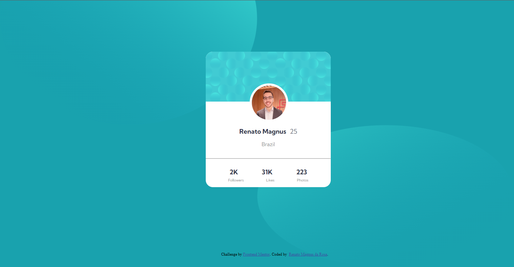

# Frontend Mentor - Profile card component solution

This is a solution to the [Profile card component challenge on Frontend Mentor](https://www.frontendmentor.io/challenges/profile-card-component-cfArpWshJ).  

## Table of contents

  - [Overview](#overview)
  - [The challenge](#the-challenge)
  - [Screenshot](#screenshot)
  - [Built with](#built-with)
  - [What I learned](#what-i-learned)
  - [Continued development](#continued-development)
  - [Author](#author)

## Overview
This was my third project. For the first time I have to work a lot with displays and was a little hard than I thought. I spent 6 hours on this and could do everything without google or a community, only me and my notes, I wanted to prove myself that I could do. 

### The challenge

- Build out the project to the designs provided.

### Screenshot

### Built with

- Semantic HTML5 markup
- CSS custom properties
- Flexbox

### What I learned

I learned that coding is painstaking work. After an hour of work, I had to start over, doing it step by step so I wouldn't skip steps and be able to see my code falling into place.

### Continued development

I realized that I need to study a little more CSS. When I do projects I feel that I learn much more than with classes. So I need to put into practice everything I've seen.

## Author

- GitHub - [rmagnusr](https://github.com/rmagnusr)
- Frontend Mentor - [@rmagnusr](https://www.frontendmentor.io/profile/rmagnusr)
- LinkedIn - (https://www.linkedin.com/in/renato-magnus/)
- WhatsApp - +55 (51) 98459-8858
